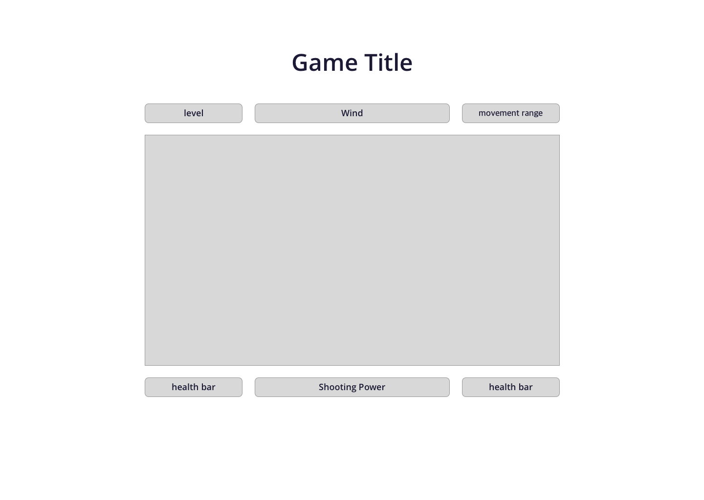

Shoot the Panzer!
===

## Table of Contents
• Game Idea - [ ] 
• Tech Stack - [ ] 
• WireFrames - [ ] 
• MVP Goals - [ ] 
• Stretch Goals - [ ] 
• Roadblocks - [ ] 

## Story of the Game
You're in mysterious world, left with a tank. All of sudden, enemy appears with a tank, trying to shoot you.

You need to drive the tank, calculate the angles to eliminate the enemy!

There are some obstacles in game. You will need to calculate the wind, make landscape your ally, and find a way to shoot the target without hitting objects.

## Interface Sequence

1. go to www.blahblah.com 
2. make a choice if you're playing with human or computer.
3. if you're playing with computer, select the level of the map.
4. use arrow key on keyboard to move the tank, and adjust shooting angle.
5. use space bar on keyboard to set shooting power.

## Tech Stack

• html 
• CSS 
• JavaScript 
• Adobe Illustrator 
• Adobe Photoshop 

## WireFrames

## MVP Goal
• Make HTML and CSS (Day1, 12/26) 
• make DOM connection and wireframe function (Day2-4, 12/29) 
• apply Cannon trajectory (Day5, 12/30) 
• Start working on detal designs (Day 6-7, 1/03) 
• Fix bug and make final delivery (Day8, 1/04) 

## Stretch Goal
• Apply Charactor Design to tank 
• Add another type of cannon functions differently 
• Apply different levels of map 
• Add mobile version of the game 

## Roadblocks
• Unfinished Tic Tac Toe assignment 
• Family vacation trip at the end of the year for 3 days.

